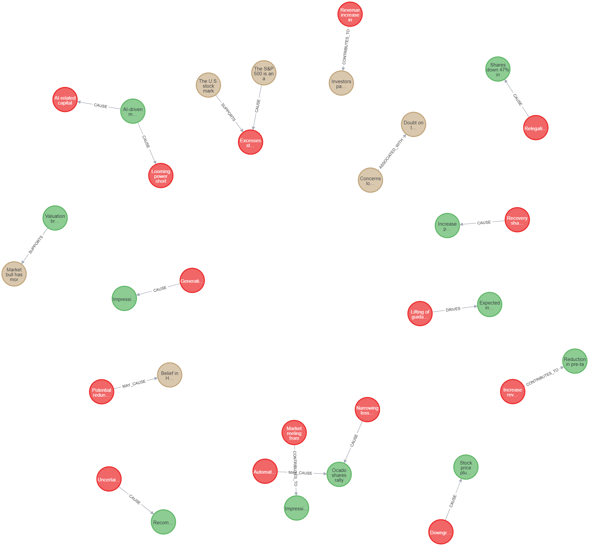

# Investment Report Graph Database

This project processes investment reports and converts them into a causal graph using an LLM (Large Language Model) and a graph database (Neo4j). The graph database stores nodes and edges representing the key factors and their causal relationships extracted from the reports.

## Components

### 1. DocumentAgent

**File:** `src/document_agent.py`

The `DocumentAgent` class is responsible for reading PDF files, splitting the text into chunks, and using the LLM to extract nodes and edges. The main functions are:
- `read_pdf(pdf_path)`: Reads a PDF file and extracts the text.
- `retrieve_information(document)`: Uses the LLM to retrieve relevant information and generate a response.
- `extract_nodes_and_edges(document)`: Parses the LLM's response to extract nodes and edges.

#### Retrieval-Augmented Generation (RAG)

The `DocumentAgent` class uses a Retrieval-Augmented Generation (RAG) approach to enhance the information extraction process. The RAG process involves the following steps:
1. **Document Splitting**: The text of the PDF document is split into smaller chunks using the `RecursiveCharacterTextSplitter`.
2. **Vector Store Initialization**: These text chunks are then converted into `Document` objects and stored in a Chroma vector store, which uses OpenAI embeddings.
3. **Relevant Snippets Retrieval**: The vector store is queried to retrieve the most relevant text snippets related to the document content.
4. **LLM Prompt Construction**: The retrieved snippets are combined with the original document content to create a comprehensive prompt for the LLM.
5. **Information Extraction**: The LLM processes this prompt and generates a response containing the nodes and edges.

### 2. GraphManager

**File:** `src/graph_manager.py`

The `GraphManager` class manages the connection to the Neo4j graph database and handles the insertion of nodes and edges. The main functions are:
- `node_exists(name, source)`: Checks if a node with a given name and source already exists in the database.
- `update_or_insert(nodes, edges)`: Inserts or updates nodes and edges in the graph database.
- `_create_node(tx, label, properties)`: Creates a node in the database.
- `_create_edge(tx, node1_name, node2_name, relationship_type)`: Creates an edge between nodes in the database, ensuring the relationship type is correctly formatted.

### 3. LLM Initialization

**File:** `src/llm_utils.py`

The `initialize_llm` function initializes the LLM using the provided API key. This function ensures that the LLM is ready for processing text and generating responses.

### 4. Prompts

**File:** `src/prompts.py`

The `EXTRACT_PROMPT` is a template used to instruct the LLM on how to extract nodes and edges from the investment report. It specifies the structure and types of nodes and edges to be extracted, and ensures relationship types are standardized.

### 5. Main Script

**File:** `src/main.py`

The main script processes multiple PDF files specified as command-line arguments, extracts nodes and edges using the `DocumentAgent`, and updates the graph database using the `GraphManager`. It also ensures that each node includes the source document name to avoid duplicates.

## Running the Project

To run the project and process PDF reports do the following setup first:

```
pip install -r requirements.txt
```
For this project, I am running a local instance of Neo4j Desktop to store the graph. A local instance of a database will need to be running for the code to work.

Make sure that you have a .env file in your root directory with a valid `OPENAI_API_KEY`. Store your documents in `data/reports` and you can run the project as such. The documents can only be in pdf format for now.

```bash
python src/main.py data/reports/report1.pdf data/reports/report2.pdf data/reports/report3.pdf
```

This will process each specified PDF file and update the graph database with nodes and edges extracted from the reports.

## Sample Graph

A sample graph image is included in the project:



The JSON information for this graph is available in `data/sample_graph.json`.

## Difficulties Encountered

During the development of this project, several difficulties were encountered:

1. **Formatting and Prompt Issues**: Ensuring the correct formatting of the prompt and response was challenging. I had to refine the prompt multiple times to ensure the LLM generated the correct structure for nodes and edges.
2. **Standardizing Relationship Types**: Limiting and standardizing the relationship types to a fixed set (e.g., CAUSE, MAY_CAUSE, etc.) was necessary to ensure consistency in the graph.
3. **Node and Edge Validation**: Implementing validation to avoid duplicate nodes and ensure all edges are valid required careful handling of the data.
4. **Access to articles**: As the website provided SeekingAplha requires a subscription beyond the first article, I have sourced a few more articles from various other places.

## Future Optimizations

There are several ways to further optimize this project:

1. **Enhance Node and Edge Validation**: Implement more robust validation mechanisms to ensure data integrity and avoid duplicates.
2. **Improve LLM Prompts**: Continue refining the prompts to improve the accuracy and relevance of the extracted nodes and edges.
3. **Expand Relationship Types**: Consider adding more nuanced relationship types to capture a wider range of interactions.
4. **Performance Optimization**: Optimize the performance of the graph database interactions, especially when dealing with large datasets.

## Technology Used

This project uses OpenAI's GPT-3.5 for extracting nodes and edges from the investment reports.
